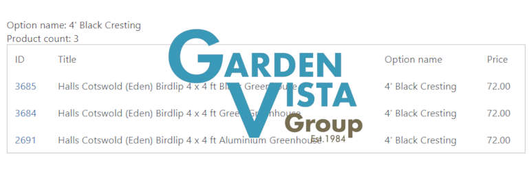

# gvg_bulk_update 

* Contributors: bobbingwide
* Donate link: https://www.oik-plugins.com/oik/oik-donate/
* Tags: Bulk update, WooCommerce, ACF, optional upgrades
* Requires at least: 5.7
* Tested up to: 6.4-RC2
* Requires PHP: 7.3
* Stable tag: 1.3.1
* License: GPLv2 or later
* License URI: http://www.gnu.org/licenses/gpl-2.0.html

## Description 
Bulk update of Optional upgrades, Product descriptions, Product Additions and Product Sales for the Garden Vista Group.

## Installation 
1. Upload the contents of the gvg_bulk_update plugin to the `/wp-content/plugins/gvg_bulk_update' directory
1. Activate the plugin through the 'Plugins' menu in WordPress
1. Use Tools > GVG Bulk update to apply bulk updates

## Screenshots 
1. Option Selection form
2. Bulk update fields
3. Option selection results
4. Bulk update processing

## Upgrade Notice 
# 1.3.1 
Upgrade for support for PHP 8.1 and PHP 8.2

## Changelog 
# 1.3.1 
* Changed: Update PHPUnit tests to run OK #9
* Changed: Update shared libraries for PHP 8.1 and PHP 8.2 #17
* Tested: With PHP 8.0, PHP 8.1 and PHP 8.2
* Tested: With WordPress 6.4-RC3

## Further reading 
GVG Bulk update uses oik shared libraries in the _GVG Bulk update_ admin page
